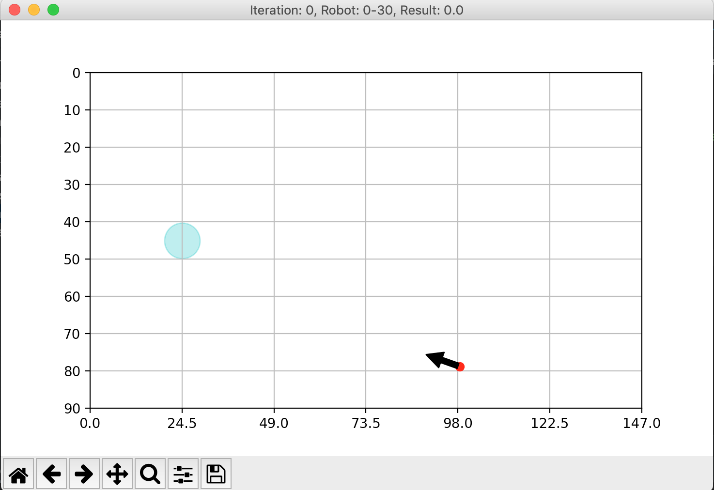

# Air Hockey Simulation - RL Algorithms

Here we are implementing two RL algorithms (Tabular Q-learning and Sarsa) on a discreate simulation of air hockey.

Here the example of a screen from the simulation:

